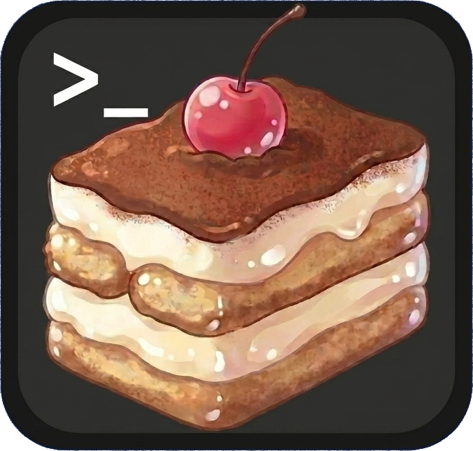

<p align="center">
  
</p>

<h1 align="center">Tiramisu</h1>

<p align="center">A desktop Claude CLI session manager with tabs, activity indicators, and notification sounds.</p>

---

Tiramisu wraps the Claude CLI in a native desktop app, making it easy to run and manage multiple sessions side by side. Each session lives in its own tab with real-time status indicators, and you get notified with a sound when a task completes.

## Features

- **Tabbed sessions** -- Run multiple Claude CLI sessions in parallel, each in its own tab
- **Integrated terminal** -- Open terminal tabs alongside chat sessions
- **Activity indicators** -- See at a glance which sessions are thinking, using tools, done, or errored
- **Notification sounds** -- Configurable sounds when sessions complete (per-tab overrides)
- **Session browser** -- Browse and resume previous Claude sessions
- **Project naming** -- Set a project name per window, shown in the OS title bar
- **Multi-window** -- Spawn new app instances from the status bar or taskbar
- **Profiles** -- Multiple home directory profiles for different Claude configurations
- **Themes** -- DaisyUI theme support
- **Permission modes** -- Default, accept edits, or bypass permissions
- **Model selection** -- Choose Claude model per tab
- **Session history** -- Conversation history loads on restart

## Tech Stack

- **Backend:** Go + [Wails v2](https://wails.io)
- **Frontend:** Vue 3 + TypeScript + Tailwind CSS 4 + DaisyUI 5
- **Terminal:** xterm.js with PTY support
- **Claude integration:** `claude` CLI with `--output-format stream-json`

## Prerequisites

- [Go](https://go.dev/) 1.23+
- [Node.js](https://nodejs.org/) 18+
- [Wails CLI](https://wails.io/docs/gettingstarted/installation) v2
- [Claude CLI](https://docs.anthropic.com/en/docs/claude-cli) installed and authenticated
- Linux: `libwebkit2gtk-4.1-dev`, `libgtk-3-dev`

## Getting Started

```bash
# Install dependencies
cd frontend && npm install && cd ..

# Run in development mode
wails dev

# Build for production
wails build
```

The built binary is output to `build/bin/tiramisu`.

## Keyboard Shortcuts

| Shortcut | Action |
|---|---|
| `Ctrl+T` | New tab |
| `Ctrl+W` | Close tab |
| `Ctrl+Tab` | Next tab |
| `Ctrl+Shift+Tab` | Previous tab |
| `Ctrl+1-9` | Jump to tab |
| `Ctrl+Shift+S` | Session browser |
| `Ctrl+D` | Toggle debug drawer |

## Configuration

Config is stored at `~/.tiramisu/config.json` and includes tab layout, theme, default sound, profiles, and project name. It persists automatically across restarts.

## License

MIT
